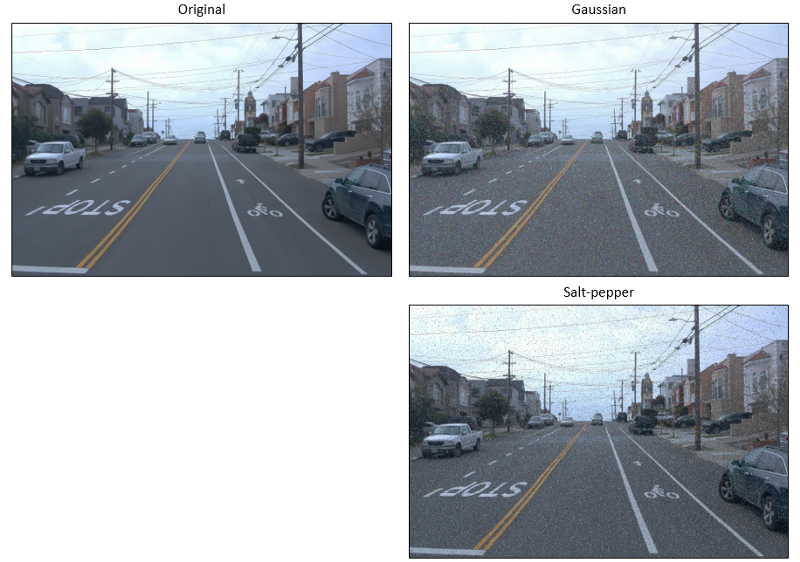

# Data Augmentation Compilation with Python and OpenCV

Data Augmentation for Object Detection with Python and OpenCV

## 1. Random Crop

## 2. Cutout

## 3. ColorJitter

## 4. Adding Noise

## 5. Filtering

Feb. 2021

Le-Anh Tran
